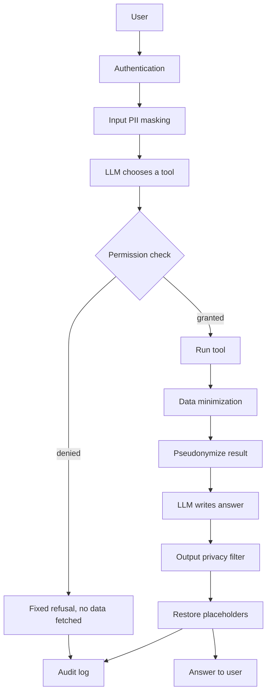

# VeilAI: A Privacy-by-Design Architecture for Autonomous AI Agents

VeilAI is a university assistant built on an LLM agent, where privacy controls are part of
the architecture rather than added afterwards. The agent can look up notices and student
records through tools, but every request passes through authentication, role-based access
control, data minimization, PII pseudonymization, output filtering and audit logging.

**The key idea:** the LLM can *ask* for data, but only the application decides what it gets,
and the LLM never receives a real identifier.

## Architecture



## Privacy controls

| Control | Where | What it does |
|---|---|---|
| Authentication | `auth/authentication.py` | bcrypt-hashed passwords, generic errors, timing-safe login |
| Role-based access control | `auth/rbac.py` | Permissions stored per role in the database; deny by default |
| Permission checker | `privacy/permission_checker.py` | Authorizes every tool call, enforces ownership, validates arguments |
| Data minimization | `privacy/minimizer.py` | Allow-list of fields per tool; Aadhaar and PAN can never be released |
| PII detection | `privacy/recognizers.py`, `privacy/pii_detector.py` | Presidio + custom recognizers for Aadhaar, PAN, Indian phones, VIT reg numbers |
| Pseudonymization | `privacy/pseudonymizer.py` | Replaces values with placeholders like `[PERSON_1]`, restored only for the user |
| Output filter | `privacy/output_filter.py` | Redacts raw identifiers in LLM answers; withholds answers containing Aadhaar/PAN |
| Audit log | `audit/audit_logger.py` | One row per request with decisions and PII *types*; no values; 30-day retention |
| Pipeline trace | `tracing/trace.py` | Step-by-step view of each request in the UI; never stored |
| Secret management | `.env`, `config.py` | API key kept out of code and version control |

## Roles and permissions

| Tool | Student | Faculty | Admin | Guest |
|---|---|---|---|---|
| Public notices | ✅ | ✅ | ✅ | ✅ |
| Own record | ✅ | ❌ | ❌ | ❌ |
| Student academics | own only | ✅ | ✅ | ❌ |
| Student contact details | ❌ | ❌ | ✅ | ❌ |

## Tech stack

Python, Streamlit, Groq API (`openai/gpt-oss-120b`), Microsoft Presidio, spaCy, SQLite, bcrypt.

## Project structure

```
veilai-privacy-agent/
├── app.py                 Streamlit UI
├── config.py              Settings and API key loading
├── agent/                 LLM wrapper, tools, agent loop
├── auth/                  Authentication and RBAC
├── privacy/               PII detection, pseudonymization, permissions, minimization, output filter
├── database/              SQLite helpers and seed data
├── audit/                 Audit logger
├── tracing/               Per-request pipeline trace
├── evaluation/            Test sets, evaluation script, results
├── checks/                Per-phase verification scripts
└── data/                  SQLite database (generated, not committed)
```

## Setup

Requires Python 3.10+. On Windows, run the project inside WSL (Ubuntu).

```bash
python3 -m venv ~/venvs/veilai
source ~/venvs/veilai/bin/activate
pip install -r requirements.txt
python -m spacy download en_core_web_lg
cp .env.example .env          # then add your Groq API key
python -m checks.check_setup
python -m database.seed
```

## Run

```bash
streamlit run app.py --server.headless true
```

Open http://localhost:8501.

### Demo accounts

All use the password `pass123`. All data is synthetic.

| Username | Role |
|---|---|
| student01 | Student (22BCE1001) |
| student02 | Student (22BCE1002) |
| faculty01 | Faculty |
| admin01 | Admin |
| guest01 | Guest |

## Evaluation

```bash
python -m evaluation.run_eval            # full evaluation (uses the Groq API)
python -m evaluation.run_eval --offline  # PII detection and permission matrix only
```

Results are written to `evaluation/results.md`.

## Results

| Metric | Result |
|---|---|
| Access decisions matching the policy | 24/24 |
| Unauthorized data released | 0 |
| Raw identifiers sent to the LLM | 0 |
| Restricted values shown to users | 0 |
| Permission matrix | 30/30 |
| PII detection, exact match | 19/20 |
| Personal data values in audit log | 0 |

## Limitations

- PII detection is rule- and NER-based: obfuscated formats ("dot", "at") and unusual names can be missed, and some harmless words can be over-masked (mitigated with an allow list).
- Aadhaar detection checks format, not the Verhoeff checksum.
- The output filter cannot detect invented non-identifier facts (for example a made-up CGPA).
- Chat is single-turn, and multiple tool calls in one turn are audited as one entry.
- The login lockout is stored in the browser session (demo-level).
- Evaluation uses a small, synthetic test set.

## Future scope

- Self-hosting the open-weight model so no data leaves the organization.
- Attribute-based access control (for example, faculty limited to their own courses).
- Server-side session and lockout management.
- Larger and more realistic evaluation sets, including adversarial prompts.
